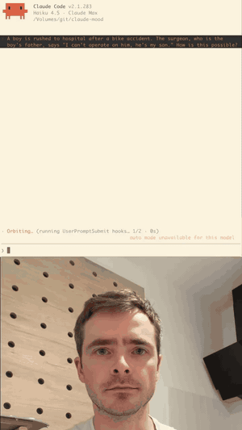

# claude-mood: give Claude Code visibility into your frustration

> **Just for fun.** This is a prototype made for the lolz, with no intention behind it beyond that. No roadmap, no support, macOS only.

<p align="center">
  <a href="docs/demo.mp4"></a>
</p>

Claude Code watches your face through the webcam, listens through the mic, and reacts:

- **Scowl, groan, say "come on" or swear at an answer:** Claude wakes up and re-checks it. No typing needed. If you get frustrated while it's working, it rethinks its approach, and after two frustrated turns it may hand off to an Opus subagent.
- **Laugh or smile:** a one-line acknowledgement, and it keeps things lean.
- **Pick up your phone:** a status update while it works, "Claude is done. Put the phone down." when it finishes, and a roast if you keep scrolling.
- **Come back after 5+ minutes away:** a one-line recap.

## Try it

Needs macOS, [uv](https://docs.astral.sh/uv/) and a working `python3` (on a fresh Mac, run `xcode-select --install` first).

```sh
# 1. In a terminal: start the sensor. Allow camera + mic; the first run downloads ~1.5 GB of models
uv run https://raw.githubusercontent.com/kasper0406/claude-mood/main/moodd.py
```

```
# 2. In Claude Code: install the plugin
/plugin marketplace add kasper0406/claude-mood
/plugin install claude-mood@claude-mood
```

For the first 2 minutes, look at the screen with a neutral face while it learns what your resting face looks like. Ctrl-C stops the sensor, and `/plugin uninstall claude-mood@claude-mood` removes the plugin.

## Run from a clone

```sh
uv run moodd.py --show              # sensor with a debug window (face box, emotion, head pose)
claude --plugin-dir /path/to/claude-mood
```

## Privacy

Frames, audio and transcripts never leave the daemon and are never written to disk. mediapipe is pinned to 0.10.21 or older because later PyPI builds include an undocumented usage logger that uploads to Google (clearcut, `play.googleapis.com`). Derived scores and matched keywords (e.g. `said "wtf" x2`) *are* sent to Claude, and so to Anthropic, as context in the focused session.

## Built on

- Face emotion: [HSEmotion](https://github.com/HSE-asavchenko/face-emotion-recognition) (Apache-2.0)
- Face mesh, head pose and brows: [MediaPipe Face Landmarker](https://ai.google.dev/edge/mediapipe/solutions/vision/face_landmarker) (Apache-2.0)
- Laughs, groans and sighs: [AST fine-tuned on AudioSet](https://huggingface.co/MIT/ast-finetuned-audioset-10-10-0.4593) (BSD-3-Clause)
- Tone of voice: [wav2vec2 SUPERB emotion recognition](https://huggingface.co/superb/wav2vec2-base-superb-er) (Apache-2.0)
- Keywords: [faster-whisper base.en](https://huggingface.co/Systran/faster-whisper-base.en) (MIT)
